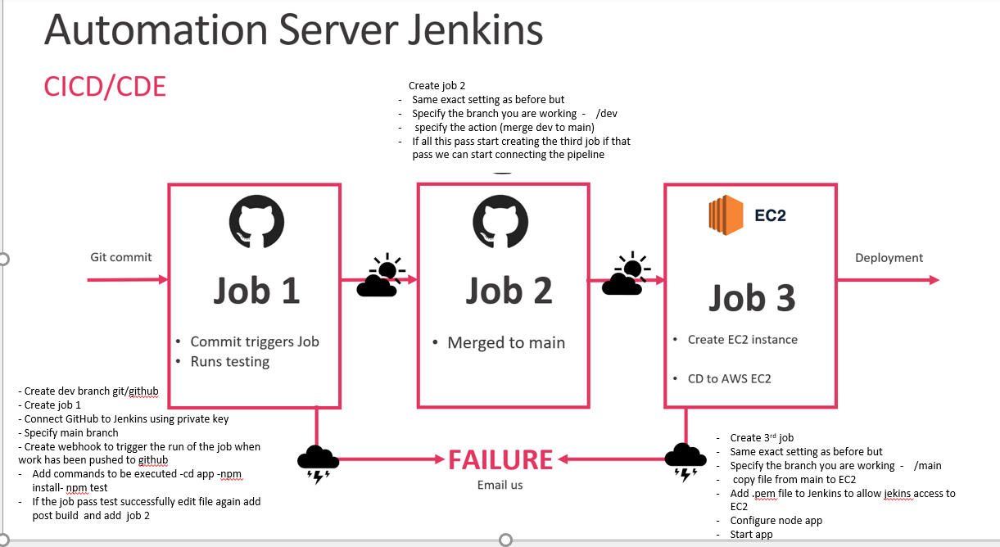
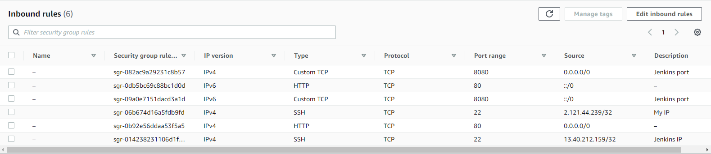

# CICD-with_jenkins
## What is Continuous integration (CI) Continuous Delivery (CD) and Continuous Deployment (CDE)?

- CI/CD is a method used to frequently deliver apps to customers by introducing automation into the stages of app development. It is considered the backbone of DevOps practices and automation.

## Continuous integration (CI)
- Continuous integration (CI) is practice that involves developers making small changes and checks to their code. Developers merge code to main branch multiple times a day and there is an automated build and test process which gives instant feedback.
    - faster software builds
    - customer satisfaction by deploying on time
    - small code changes make fault isolation simpler and quicker
    - improve software build

## Continuous Delivery (CD)
- Continuous delivery (CD) is an extension of continuous integration. It makes sure you can release new changes to your customers quickly as it automates the release process so you can deploy the application at any time by just clicking a button. In continuous Delivery the deployment is completed manually.

## Continuous Deployment (CDE)
- CDE we go one step further than continuous delivery by deploying to our customers after every development change. There is no human intervention in CDE, unlike continuous delivery, no button has to be pressed to deploy the application. Only a failed test will prevent a new change being deployed to production.

## CD VS CDE
- Continuous integration forms a part of both continuous delivery and continuous deployment.

- In continuous delivery the deployment is done manually and in continuous deployment it happens automatically.

## What is Jenkins? 

- Jenkins is an open source automation server. It helps automate the parts of software development related to building, testing, and deploying, facilitating continuous integration and continuous delivery.

## .pub and private keys (SSH keys) SET-UP
- Open GitBash as an admin
- cd .ssh
- Enter ssh-keygen -t rsa -b 4096 -C "your GitHub Email"
   - The following prompt "Enter a file in which to save the key (/Users/you/.ssh/id_rsa):" Enter file name
   - No passphrase - hit enter
- Access the public key - "cat eng110_shuvo.pub" -and copy the key
- Go on GitHub and click on your profile 
- Scroll down to settings 
- On the left CLick on SSH and GPG keys
- Press on new SSH key paste the content of your eng110_shuvo.pub file

## Connect GitHub repository to Jenkins
- Open GitBash as an admin
- cd .ssh
- Enter ssh-keygen -t rsa -b 4096 -C "your GitHub Email"
   - The following prompt "Enter a file in which to save the key (/Users/you/.ssh/id_rsa):" Enter file name
   - No passphrase - hit enter
- Go to github repository
- Click on 'Settings'
   - 'Deploy key'
   - 'Add key'
   - Paste the private key
- On Jenkins, create a build.
- Tick Discard old builds. Max # of builds to keep = 3.
- GitHub project - use the http link NOT ssh.
- Tick restrict where this project can be run.
- For Label Expression, type in sparta-ubuntu-node (might need to press backspace and fiddle around with it until it recognises the label).
- For Source Code Management, choose Git.
- For Repository URL, choose the repository's SSH link.
- Run this command on the private key generated: clip < ~/.ssh/eng110_cicd_sam.
- Credientials: add a new key.
- Choose SSH Keys. Give it the same name as your private key (for example eng110_cicd_sam).
- Paste the private key's contents into the box.
- Make sure it is */main and not */master
- Tick Provide Node & npm bin/ folder to PATH
- Go to build - execute shell
- Type in these commands - make sure the path to your app folder is right:
   - cd app
   - npm instal
   - npm test

## Webhook set-up  between GitHub and Jenkins
- On Jenkins select `Configure` for your build
- Under `Build Triggers`, select `GitHub hook trigger for GITScm polling`
- On Github, in your repository select `settings`
- Select `Webhook` from the menu on the left side
- Select `Add new`
- Enter the payload URL eg. `http://ipaddress:port/github-webhook/`
- Select `application/json` from the drop down menu
- Check `Send me everything`
- Test webhook by pushing a commit to your GitHub repository. This should automatically trigger the Jenkins job to run

# CI Task



## Job 1

- Click on `Create new build`
- Name the build
- Check `Discard old builds` and choose `3` as the `Max # of builds to keep`
- Check `GitHub project` and paste your repository's URL HTTPS format
- Check `Restrict where this project can be run` (sparta-ubuntu-node)
- Check `Git.` Link your GitHub repository again (SSH format)
- Choose the right `private key` to unlock the repository's `public key`
- Choose `*/dev` in branch
- Select `GithHub hook trigger`
- Select `Provide Node & npm bin/ folder to PATH.\`
- Go to Build, and choose `Execute shell`, set up with these commands:
    - `cd app`
    - `npm install`
    - `npm test`
- For Post-build Actions, choose Job 2 in Build other projects (which will be created next)
- Click `save`

## Job 2 

- Click on `Create new build`
- Name the build
- Select the `GitHub settings` again and `Discard old builds`
- For branch, choose `*/dev` because we are working in the dev branch
- Select `Additional Behaviours`
   - add `origin` for `Name of repository`
   - add `main` as Branch to merge to
- select `Post-Build Actions` and name it `Job 3`
- In `Post-Build-Actions` select `Git Publisher`
   - tick `Push only if build succeeds and Merge results`
- Click `save`

## Job 3

- Click on `Create new build`
- Name the build
- Check `Discard old builds` and choose `3` as the `Max # of builds to keep`
- Check `GitHub project` and paste your repository's URL HTTPS format
- Check `Restrict where this project can be run` (sparta-ubuntu-node)
- Check `Git.` Link your GitHub repository again (SSH format)
- Choose the right `private key` to unlock the repository's `public key`
- Choose `*/main` in branch
- SSH Agent: choose the private key to unlock the EC2 instance's public key.


Now we need to by pass the key asking stage with below command:
ssh -A -o "StrictHostKeyChecking=no" ubuntu@ec2-ip << EOF	
- copy the the code
- run your provision.sh to install node with required dependencies for app instance - same goes for db instance (ensure to double check if node and db are actively running)
- create an env to connect to db
- navigate to app folder
- kill any existing pm2 process just in case
- launch the app
nohup node app.js > /dev/null 2>&1 & - use this command to run node app in the background
- To debug ssh into your ec2 and run the above commands

- Run these commands under Execute shell:

```bash
    
EOF

# ssh into ec2
# update upgrade, run the provisioning script or install nginx to test
# scp to copy data from github to ec2
ssh -A -o "StrictHostKeyChecking=no" ubuntu@54.246.60.105 << EOF
#export DB_HOST=mongodb://54.75.96.210:27017/posts
sudo apt-get update -y
sudo apt-get upgrade -y
sudo apt-get install nginx -y
sudo systemctl restart nginx
sudo systemctl enable nginx
scp -
cd app/app/
sudo chmod +x provision.sh
sudo /.provision.sh
cd app
npm install
npm start
```
- SPin an EC2 instance and use these security group:




```bash
rsync -avz -e "ssh -o StrictHostKeyChecking=no" app ubuntu@ec2-52-50-217-189.eu-west-1.compute.amazonaws.com:~/.
ssh -A -o "StrictHostKeyChecking=no" ubuntu@52.50.217.189 << EOF
     
     sudo apt-get update -y
     sudo apt-get upgrade -y
     sudo apt-get install nginx -y
     sudo systemctl restart nginx
     sudo systemctl enable nginx
EOF
```


username: devopslondon

DevOpsAdmin
test5


